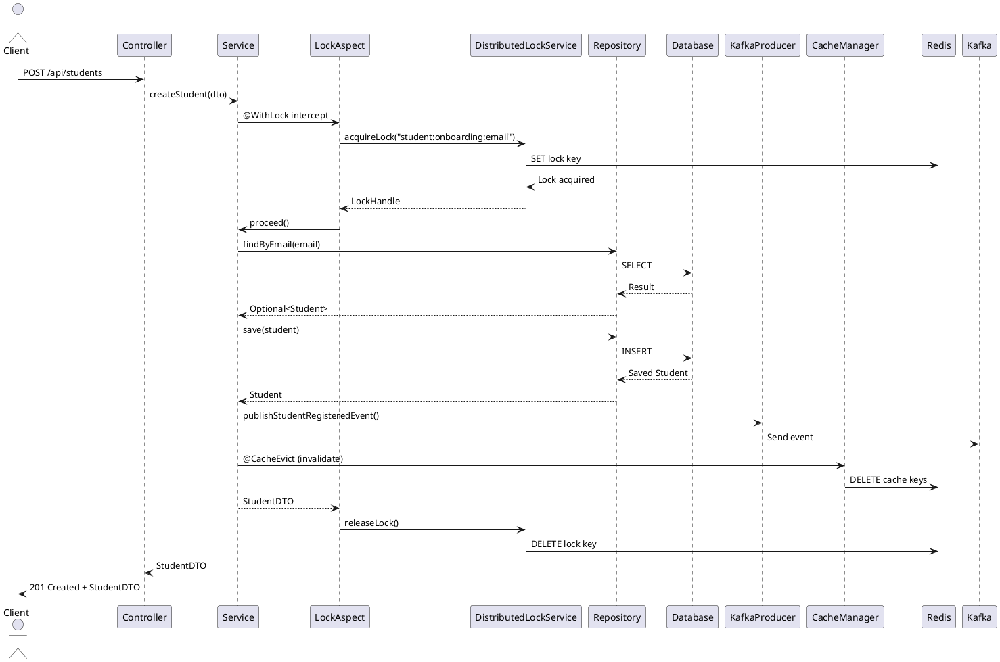
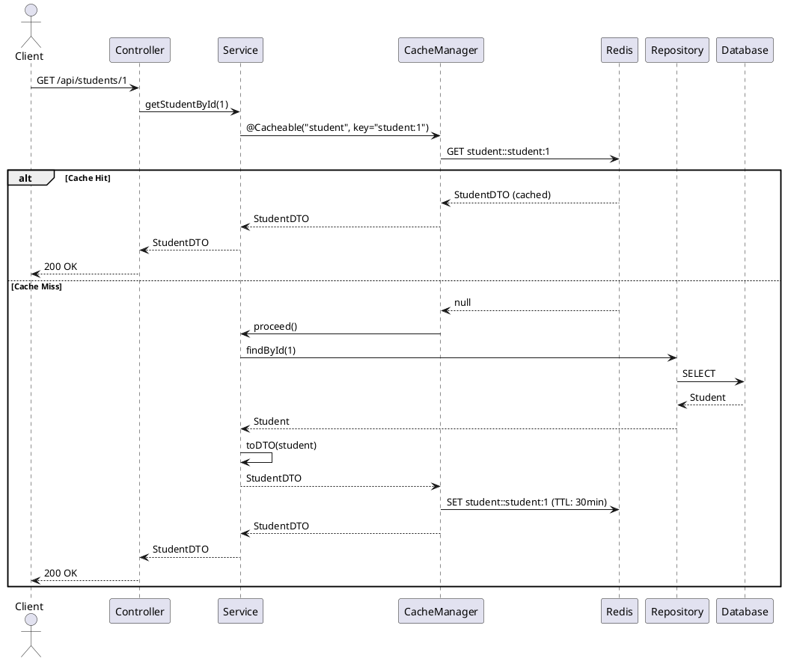
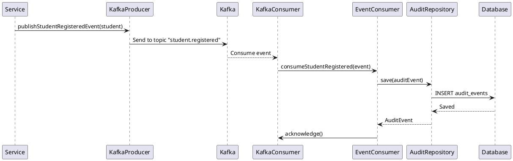

# Academy Backend - Complete Project Documentation

## Table of Contents

1. [High-Level Architecture](#high-level-architecture)
2. [Low-Level Design](#low-level-design)
3. [Database Design](#database-design)
4. [Redis Caching Strategy](#redis-caching-strategy)
5. [API Documentation](#api-documentation)
6. [Error Handling](#error-handling)
7. [Cache Invalidation](#cache-invalidation)
8. [Sequence Diagrams](#sequence-diagrams)
9. [Deployment Guide](#deployment-guide)
10. [Running with Docker](#running-with-docker)
11. [Integration Testing Method](#integration-testing-method)
12. [Limitations](#limitations)
13. [Future Enhancements](#future-enhancements)

---

## High-Level Architecture

### System Overview

The Academy Backend is a production-ready Spring Boot application built with a multi-module architecture, implementing event-driven patterns with Kafka, Redis caching, and JWT authentication.

### Architecture Diagram

```
┌─────────────────────────────────────────────────────────────────┐
│                         Client Layer                            │
│                    (Web/Mobile Applications)                     │
└────────────────────────────┬────────────────────────────────────┘
                              │
                              │ HTTPS/REST
                              │
┌─────────────────────────────▼────────────────────────────────────┐
│                      API Gateway Layer                           │
│  ┌──────────────────────────────────────────────────────────┐   │
│  │  Spring Security + JWT Authentication Filter              │   │
│  └──────────────────────────────────────────────────────────┘   │
│  ┌──────────────────────────────────────────────────────────┐   │
│  │  REST Controllers (OpenAPI Generated)                     │   │
│  │  - StudentController                                      │   │
│  │  - BatchController                                        │   │
│  │  - ClassController                                        │   │
│  │  - MentorController                                       │   │
│  │  - MentorSessionController                                │   │
│  │  - AuthController                                         │   │
│  └──────────────────────────────────────────────────────────┘   │
└─────────────────────────────┬────────────────────────────────────┘
                              │
        ┌─────────────────────┼─────────────────────┐
        │                     │                     │
┌───────▼────────┐   ┌────────▼────────┐   ┌───────▼────────┐
│  Service Layer │   │  Cache Layer    │   │  Kafka Layer   │
│                │   │                 │   │                │
│  - Student     │   │  Redis Cache    │   │  - Producers   │
│  - Batch       │◄──┤  Manager         │   │  - Consumers   │
│  - Class       │   │  (TTL-based)    │   │                │
│  - Mentor      │   │                 │   │                │
│  - MentorSession│  └─────────────────┘   └────────────────┘
└───────┬────────┘
        │
┌───────▼────────┐
│  Data Layer    │
│                │
│  - JPA Repos   │
│  - Entities    │
│  - Flyway      │
└───────┬────────┘
        │
┌───────▼────────┐
│  Database      │
│  (MySQL 8.0)   │
└────────────────┘
```

### Technology Stack

- **Java 21** - Programming language
- **Spring Boot 3.2.0** - Application framework
- **Spring Data JPA** - Data persistence
- **Spring Data Redis** - Caching layer
- **Spring Kafka** - Event-driven messaging
- **Spring Security** - Authentication & authorization
- **MySQL 8.0** - Relational database
- **Redis 7** - In-memory cache
- **Apache Kafka** - Message broker
- **Flyway** - Database migrations
- **MapStruct** - DTO mapping
- **Lombok** - Boilerplate reduction
- **OpenAPI/Swagger** - API documentation
- **Docker & Docker Compose** - Containerization

### Module Structure

```
academy-backend/
├── modules/
│   ├── academy-api/              # API layer (controllers, security, config)
│   ├── academy-service/          # Business logic (services, mappers)
│   ├── academy-common/           # Shared entities, DTOs, exceptions
│   ├── academy-kafka-producer/   # Kafka event producers
│   └── academy-kafka-consumer/   # Kafka event consumers
```

---

## Low-Level Design

### Component Architecture

#### 1. API Module (`academy-api`)

**Controllers:**
- Implement OpenAPI-generated interfaces
- Handle HTTP requests/responses
- Delegate to service layer
- Use generated models from OpenAPI spec

**Security:**
- JWT-based authentication
- Configurable header name/prefix
- Spring Security filter chain
- Role-based access control (future)

**Configuration:**
- Redis configuration with TTL
- Kafka topic configuration
- OpenAPI generation
- CORS configuration

#### 2. Service Module (`academy-service`)

**Services:**
- Business logic implementation
- Transaction management
- Cache annotations (`@Cacheable`, `@CacheEvict`)
- Distributed locking (`@WithLock`)

**Mappers:**
- MapStruct-based DTO/Entity mapping
- Explicit `@Mapping` annotations
- Version field mapping for optimistic locking

**Aspects:**
- `LockAspect` - AOP for distributed locking
- SpEL-based lock key resolution

#### 3. Common Module (`academy-common`)

**Entities:**
- JPA entities with optimistic locking (`@Version`)
- Relationships (OneToMany, ManyToOne)
- Validation annotations

**DTOs:**
- Data transfer objects
- Validation constraints
- Version fields

**Exceptions:**
- Custom exception hierarchy
- Global exception handler
- Problem Details (RFC 7807)

**Repositories:**
- Spring Data JPA repositories
- Custom query methods
- Pessimistic locking support

#### 4. Kafka Modules

**Producer (`academy-kafka-producer`):**
- Event DTOs
- KafkaTemplate-based publishing
- Event type definitions

**Consumer (`academy-kafka-consumer`):**
- Kafka listeners with retry
- Manual acknowledgment
- Audit event persistence

### Design Patterns

1. **Repository Pattern** - Data access abstraction
2. **Service Layer Pattern** - Business logic separation
3. **DTO Pattern** - Data transfer objects
4. **Factory Pattern** - Object creation (mappers)
5. **Aspect-Oriented Programming** - Cross-cutting concerns (locking, caching)
6. **Event-Driven Architecture** - Kafka-based messaging
7. **Strategy Pattern** - Cache TTL strategies
8. **Template Method** - Base service methods

### Key Design Decisions

1. **Multi-Module Architecture**: Separation of concerns, independent deployment
2. **OpenAPI-Driven APIs**: Single source of truth, type safety
3. **Redis Caching**: Performance optimization with TTL-based expiration
4. **Distributed Locking**: Prevents race conditions in concurrent scenarios
5. **Optimistic Locking**: Database-level concurrency control
6. **Event-Driven**: Loose coupling via Kafka events
7. **JWT Authentication**: Stateless, scalable authentication

---

## Database Design

### Entity Relationship Diagram

```
┌─────────────────────────────────────────────────────────────────────────┐
│                         ACADEMY DATABASE SCHEMA                          │
└─────────────────────────────────────────────────────────────────────────┘

┌──────────────┐
│  BatchType   │
├──────────────┤
│ id (PK)      │
│ name (UNIQUE)│
└──────┬───────┘
       │
       │ 1
       │
       │ Many
       ▼
┌──────────────┐         ┌──────────────┐         ┌──────────────┐
│    Batch     │◄────────┤   Student    │─────────┤   Student    │
├──────────────┤         ├──────────────┤         │  (Self-Ref)  │
│ id (PK)      │    Many │ id (PK)      │   1     │ buddyId (FK) │
│ name         │         │ name         │         └──────────────┘
│ startMonth   │         │ email (UNIQUE)│
│ instructor   │         │ gradYear      │
│ batchTypeId  │         │ university    │
│ version      │         │ phone         │
└──────┬───────┘         │ batchId (FK) │
       │                 │ buddyId (FK) │
       │ Many            │ version      │
       │                 └──────┬───────┘
       │                        │
       │                        │ Many
       │                        │
       │ Many                   ▼
       │                 ┌──────────────────┐
       │                 │ MentorSession    │
       │                 ├──────────────────┤
       │                 │ id (PK)         │
       │                 │ time            │
       │                 │ durationMinutes  │
       │                 │ studentId (FK)  │
       │                 │ mentorId (FK)   │
       │                 │ studentRating   │
       │                 │ mentorRating    │
       │                 │ version         │
       │                 └────────┬─────────┘
       │                          │
       │                          │ Many
       │                          │
       │                          │ 1
       │                          ▼
       │                 ┌──────────────┐
       │                 │   Mentor     │
       │                 ├──────────────┤
       │                 │ id (PK)      │
       │                 │ name         │
       │                 │ company      │
       │                 └──────────────┘
       │
       │ Many
       │
       ▼
┌──────────────┐
│    Class     │
├──────────────┤
│ id (PK)      │
│ name         │
│ date         │
│ time         │
│ instructor   │
└──────────────┘
       ▲
       │
       │ Many (via batches_classes join table)
       │
       │
┌──────────────┐
│    Batch     │
└──────────────┘

┌─────────────────────────────────────────────────────────────────────────┐
│                         AUDIT & HISTORY TABLES                           │
└─────────────────────────────────────────────────────────────────────────┘

┌──────────────────┐         ┌──────────────────────────┐
│  AuditEvent      │         │ StudentBatchHistory       │
├──────────────────┤         ├──────────────────────────┤
│ id (PK)          │         │ id (PK)                  │
│ eventType        │         │ studentId (FK)           │
│ payload (TEXT)   │         │ batchId (FK)             │
│ createdAt        │         │ shiftDate                │
└──────────────────┘         └──────────────────────────┘
(Kafka Consumer)              (Historical tracking)

┌─────────────────────────────────────────────────────────────────────────┐
│                         RELATIONSHIP SUMMARY                              │
├─────────────────────────────────────────────────────────────────────────┤
│ BatchType  ──(1:Many)──> Batch                                         │
│ Batch      ──(1:Many)──> Student                                       │
│ Student    ──(Many:1)──> Batch                                         │
│ Student    ──(Self-Ref)──> Student (buddyId)                            │
│ Batch      ──(Many:Many)──> Class (via batches_classes)                 │
│ Student    ──(1:Many)──> MentorSession                                  │
│ Mentor     ──(1:Many)──> MentorSession                                 │
│ Student    ──(1:Many)──> StudentBatchHistory                            │
│ Batch      ──(1:Many)──> StudentBatchHistory                            │
└─────────────────────────────────────────────────────────────────────────┘
```

### Database Schema

#### Tables

1. **batch_types**
   - `id` (BIGINT, PK, AUTO_INCREMENT)
   - `name` (VARCHAR(255), NOT NULL)
   - `description` (TEXT)

2. **batches**
   - `id` (BIGINT, PK, AUTO_INCREMENT)
   - `name` (VARCHAR(255), NOT NULL)
   - `start_month` (DATE)
   - `current_instructor` (VARCHAR(255))
   - `batch_type_id` (BIGINT, FK → batch_types.id)
   - `version` (INT, for optimistic locking)

3. **students**
   - `id` (BIGINT, PK, AUTO_INCREMENT)
   - `name` (VARCHAR(255), NOT NULL)
   - `email` (VARCHAR(255), UNIQUE, NOT NULL)
   - `graduation_year` (INT)
   - `university_name` (VARCHAR(255))
   - `phone_number` (VARCHAR(50))
   - `batch_id` (BIGINT, FK → batches.id, NULLABLE)
   - `buddy_id` (BIGINT, FK → students.id, NULLABLE)
   - `version` (INT, for optimistic locking)

4. **classes**
   - `id` (BIGINT, PK, AUTO_INCREMENT)
   - `name` (VARCHAR(255), NOT NULL)
   - `date` (DATE, NOT NULL)
   - `time` (TIME, NOT NULL)
   - `instructor` (VARCHAR(255), NOT NULL)

5. **mentors**
   - `id` (BIGINT, PK, AUTO_INCREMENT)
   - `name` (VARCHAR(255), NOT NULL)
   - `current_company` (VARCHAR(255))

6. **mentor_sessions**
   - `id` (BIGINT, PK, AUTO_INCREMENT)
   - `time` (DATETIME, NOT NULL)
   - `duration_minutes` (INT, NOT NULL)
   - `student_id` (BIGINT, FK → students.id, NOT NULL)
   - `mentor_id` (BIGINT, FK → mentors.id, NOT NULL)
   - `student_rating` (INT, 1-5)
   - `mentor_rating` (INT, 1-5)
   - `version` (INT, for optimistic locking)

7. **batch_classes** (Join Table - Many-to-Many)
   - `batch_id` (BIGINT, FK → batches.id)
   - `class_id` (BIGINT, FK → classes.id)
   - Primary Key: (batch_id, class_id)

8. **audit_events** (Kafka Consumer - Event Storage)
   - `id` (BIGINT, PK, AUTO_INCREMENT)
   - `event_type` (VARCHAR(255), NOT NULL)
   - `payload` (TEXT, JSON)
   - `created_at` (TIMESTAMP, NOT NULL)

9. **student_batch_history** (Historical Tracking)
   - `id` (BIGINT, PK, AUTO_INCREMENT)
   - `student_id` (BIGINT, FK → students.id, NOT NULL)
   - `batch_id` (BIGINT, FK → batches.id, NOT NULL)
   - `shift_date` (DATE, NOT NULL)

### Indexes

**Primary Keys:**
- All tables have `id` as PRIMARY KEY with AUTO_INCREMENT

**Unique Indexes:**
- `students.email` - UNIQUE constraint
- `batch_type.name` - UNIQUE constraint

**Foreign Key Indexes:**
- `batches.batch_type_id` - FK to `batch_type.id`
- `students.batch_id` - FK to `batches.id`
- `students.buddy_id` - FK to `students.id` (self-reference)
- `mentor_sessions.student_id` - FK to `students.id`
- `mentor_sessions.mentor_id` - FK to `mentors.id`
- `student_batch_history.student_id` - FK to `students.id`
- `student_batch_history.batch_id` - FK to `batches.id`

**Composite Indexes:**
- `batch_classes(batch_id, class_id)` - Composite primary key

### Migrations

Flyway manages database schema:
- `V1__init.sql` - Initial schema and sample data
- `V2__add_version_columns.sql` - Optimistic locking support

---

## Redis Caching Strategy

### Current Implementation

The project uses **Spring Cache abstraction** with Redis as the backing store. While the master prompt suggests custom caching, the current implementation uses `@Cacheable` and `@CacheEvict` annotations for simplicity and maintainability.

### Cache Configuration

**Location:** `modules/academy-api/src/main/java/com/academy/config/RedisConfig.java`

**Key Features:**
- JSON serialization for cache values
- String serialization for keys
- TTL-based expiration
- Null value prevention
- Per-cache TTL configuration

### Cache Key Naming

**Current Pattern (Spring Cache):**
```
{cacheName}::{keyExpression}
```

**Examples:**
- `student::student:1` - Individual student cache
- `students::batch:1` - Students by batch
- `students::all` - All students
- `batch::batch:1` - Individual batch cache

**Recommended Pattern (for custom implementation):**
```
APP:{MODULE}:{ENTITY}:{ID}
```

**Examples:**
- `APP:ACADEMY:STUDENT:101`
- `APP:ACADEMY:STUDENT:LIST:BATCH:1`
- `APP:ACADEMY:BATCH:5`

### TTL Strategy

**Default TTL:** 30 minutes

**Cache-Specific TTLs:**

| Cache Name | TTL | Reason |
|------------|-----|--------|
| `mentorSessions`, `mentorSession` | 10 minutes | Frequently changing data |
| `mentors`, `mentor`, `batchTypes`, `batchType` | 1 hour | Stable reference data |
| `students`, `student`, `batches`, `batch`, `classes`, `class` | 30 minutes | Default for transactional data |

### Caching Rules

**What Gets Cached:**
- ✅ GET operations (read-only)
- ✅ Non-null results
- ✅ Non-empty collections
- ✅ Successful responses

**What Doesn't Get Cached:**
- ❌ POST/PUT/DELETE responses
- ❌ Null values
- ❌ Empty collections (via `unless` condition)
- ❌ Error responses

### Cache Invalidation

**Automatic Invalidation:**
- `@CacheEvict` on create/update/delete operations
- Pattern-based eviction (e.g., `allEntries = true`)

**Current Implementation:**
```java
@CacheEvict(value = {"student", "students"}, allEntries = true)
public StudentDTO createStudent(StudentDTO dto) { ... }

@CacheEvict(value = {"student", "students"}, key = "'student:' + #id", allEntries = true)
public StudentDTO updateStudent(Long id, StudentDTO dto) { ... }
```

**Recommended Custom Implementation:**
```java
public void invalidateStudent(Long id) {
    // Delete specific key
    redisTemplate.delete("APP:ACADEMY:STUDENT:" + id);
    // Delete list keys
    redisTemplate.delete("APP:ACADEMY:STUDENT:LIST:*");
}
```

### Redis Connection Pooling

**Lettuce Configuration:**
```yaml
spring:
  redis:
    lettuce:
      pool:
        max-active: 8
        max-idle: 8
        min-idle: 0
```

### Cache Validation

**Current:** Spring Cache handles null prevention via `disableCachingNullValues()`

**Recommended Custom Validator:**
```java
public class RedisValueValidator {
    public static boolean isCacheable(Object result) {
        if (result == null) return false;
        if (result instanceof Collection && ((Collection<?>) result).isEmpty()) return false;
        if (result instanceof Exception) return false;
        return true;
    }
}
```

### Cache Monitoring

**Actuator Endpoints:**
- `/actuator/health` - Redis connection health
- `/actuator/metrics` - Cache metrics (if enabled)

**Redis CLI Commands:**
```bash
# Check cache keys
docker exec -it academy-redis redis-cli KEYS "*student*"

# Check TTL
docker exec -it academy-redis redis-cli TTL "student::student:1"

# Monitor commands
docker exec -it academy-redis redis-cli MONITOR
```

---

## API Documentation

### Base URL

- **Local:** `http://localhost:8080`
- **Docker:** `http://localhost:8080`

### Authentication

All APIs (except `/api/auth/**`) require JWT authentication.

**Header Format:**
```
Authorization: Bearer <jwt-token>
```

**Configurable:**
- Header name: `jwt.header.name` (default: `Authorization`)
- Header prefix: `jwt.header.prefix` (default: `Bearer `)

### Authentication APIs

#### 1. Login

**POST** `/api/auth/login`

**Request:**
```json
{
  "username": "admin@academy.com",
  "password": "password123"
}
```

**Response (200):**
```json
{
  "token": "eyJhbGciOiJIUzI1NiIsInR5cCI6IkpXVCJ9...",
  "type": "Bearer"
}
```

#### 2. Validate Token

**POST** `/api/auth/validate`

**Request:**
```json
{
  "token": "eyJhbGciOiJIUzI1NiIsInR5cCI6IkpXVCJ9..."
}
```

**Response (200):**
```json
{
  "valid": true,
  "username": "admin@academy.com"
}
```

### Student APIs

#### 1. Get All Students

**GET** `/api/students?batchId={id}`

**Query Parameters:**
- `batchId` (optional) - Filter by batch ID

**Response (200):**
```json
[
  {
    "id": 1,
    "name": "Alice Smith",
    "email": "alice@example.com",
    "graduationYear": 2023,
    "universityName": "State University",
    "phoneNumber": "123-456-7890",
    "batchId": 1,
    "buddyId": null
  }
]
```

**Caching:** ✅ Cached with key `students::batch:{id}` or `students::all`

#### 2. Get All Students (Paginated)

**GET** `/api/students/paged?page=0&size=20&sort=name,asc`

**Response (200):**
```json
{
  "content": [...],
  "totalElements": 100,
  "totalPages": 5,
  "size": 20,
  "number": 0,
  "first": true,
  "last": false
}
```

#### 3. Get Student by ID

**GET** `/api/students/{id}`

**Response (200):**
```json
{
  "id": 1,
  "name": "Alice Smith",
  "email": "alice@example.com",
  ...
}
```

**Caching:** ✅ Cached with key `student::student:{id}`

#### 4. Create Student

**POST** `/api/students`

**Request:**
```json
{
  "name": "Alice Smith",
  "email": "alice@example.com",
  "graduationYear": 2023,
  "universityName": "State University",
  "phoneNumber": "123-456-7890",
  "batchId": 1
}
```

**Response (201):**
```json
{
  "id": 1,
  "name": "Alice Smith",
  ...
}
```

**Kafka Event:** Publishes `student.registered` event

**Cache Invalidation:** ✅ Evicts `student` and `students` caches

#### 5. Update Student

**PUT** `/api/students/{id}`

**Request:** Same as create

**Response (200):** Updated student object

**Cache Invalidation:** ✅ Evicts specific student and list caches

#### 6. Delete Student

**DELETE** `/api/students/{id}`

**Response (204):** No content

**Cache Invalidation:** ✅ Evicts caches

### Batch APIs

#### 1. Get All Batches (Paginated)

**GET** `/api/batches?page=0&size=20`

**Caching:** ✅ Cached

#### 2. Get Batch by ID

**GET** `/api/batches/{id}`

**Caching:** ✅ Cached

#### 3. Create Batch

**POST** `/api/batches`

**Kafka Event:** Publishes `batch.created` event

#### 4. Update Batch

**PUT** `/api/batches/{id}`

#### 5. Delete Batch

**DELETE** `/api/batches/{id}`

#### 6. Assign Class to Batch

**POST** `/api/batches/{id}/classes/{classId}`

### Class APIs

- **GET** `/api/classes` - Get all classes
- **GET** `/api/classes/{id}` - Get class by ID
- **POST** `/api/classes` - Create class
- **PUT** `/api/classes/{id}` - Update class
- **DELETE** `/api/classes/{id}` - Delete class

### Mentor APIs

- **GET** `/api/mentors` - Get all mentors
- **GET** `/api/mentors/{id}` - Get mentor by ID
- **POST** `/api/mentors` - Create mentor
- **PUT** `/api/mentors/{id}` - Update mentor
- **DELETE** `/api/mentors/{id}` - Delete mentor

### Mentor Session APIs

- **GET** `/api/mentor-sessions` - Get all sessions
- **GET** `/api/mentor-sessions/{id}` - Get session by ID
- **POST** `/api/mentor-sessions` - Create session (publishes Kafka event)
- **PUT** `/api/mentor-sessions/{id}` - Update session
- **DELETE** `/api/mentor-sessions/{id}` - Delete session

### Error Responses

All errors follow RFC 7807 Problem Details format:

```json
{
  "type": "about:blank",
  "title": "Student Not Found",
  "status": 404,
  "detail": "Student with id 999 not found",
  "instance": "/api/students/999"
}
```

---

## Error Handling

### Exception Hierarchy

```
Exception
├── RuntimeException
    ├── StudentNotFoundException
    ├── BatchNotFoundException
    ├── ClassNotFoundException
    ├── MentorNotFoundException
    ├── MentorSessionNotFoundException
    ├── BatchTypeNotFoundException
    ├── LockAcquisitionException
    └── OptimisticLockException
```

### Global Exception Handler

**Location:** `modules/academy-common/src/main/java/com/academy/exception/GlobalExceptionHandler.java`

**Features:**
- Converts exceptions to Problem Details (RFC 7807)
- Logs errors with context
- Provides consistent error responses
- Handles validation errors

### Error Response Format

```json
{
  "type": "uri://academy-backend/errors/student-not-found",
  "title": "Student Not Found",
  "status": 404,
  "detail": "Student with id 999 not found",
  "instance": "/api/students/999"
}
```

### Cache Error Handling

**Current:** Errors are never cached (Spring Cache handles this)

**Custom Implementation:**
```java
try {
    Object result = service.getData();
    if (RedisValueValidator.isCacheable(result)) {
        cacheService.put(key, result, ttl);
    }
} catch (Exception e) {
    // Never cache errors
    throw e;
}
```

---

## Cache Invalidation

### Current Strategy

**Automatic Invalidation via `@CacheEvict`:**

1. **Create Operations:**
   ```java
   @CacheEvict(value = {"student", "students"}, allEntries = true)
   ```

2. **Update Operations:**
   ```java
   @CacheEvict(value = {"student", "students"}, key = "'student:' + #id", allEntries = true)
   ```

3. **Delete Operations:**
   ```java
   @CacheEvict(value = {"student", "students"}, key = "'student:' + #id", allEntries = true)
   ```

### Invalidation Patterns

**Specific Key:**
- `student::student:1` - Single entity cache

**Pattern-Based:**
- `students::*` - All list caches
- `student::*` - All entity caches

### Recommended Custom Implementation

```java
@Service
public class CacheInvalidationService {
    
    public void invalidateStudent(Long id) {
        // Delete specific entity
        redisTemplate.delete("APP:ACADEMY:STUDENT:" + id);
        
        // Delete all list caches
        Set<String> keys = redisTemplate.keys("APP:ACADEMY:STUDENT:LIST:*");
        if (keys != null && !keys.isEmpty()) {
            redisTemplate.delete(keys);
        }
    }
    
    public void invalidateAllStudents() {
        Set<String> keys = redisTemplate.keys("APP:ACADEMY:STUDENT:*");
        if (keys != null && !keys.isEmpty()) {
            redisTemplate.delete(keys);
        }
    }
}
```

---

## Sequence Diagrams

### Student Creation Flow



### Student Retrieval with Cache



### Kafka Event Processing



---

## Deployment Guide

### Prerequisites

- Docker & Docker Compose
- Java 21+ (for local development)
- MySQL 8.0+ (if not using Docker)
- Redis 7+ (if not using Docker)
- Kafka (if not using Docker)

### Environment Variables

**Application:**
```bash
SPRING_PROFILES_ACTIVE=docker
SPRING_DATASOURCE_URL=jdbc:mysql://mysql:3306/academy_db
SPRING_DATASOURCE_USERNAME=root
SPRING_DATASOURCE_PASSWORD=rootpassword
SPRING_KAFKA_BOOTSTRAP_SERVERS=kafka:9092
SPRING_REDIS_HOST=redis
SPRING_REDIS_PORT=6379
JWT_SECRET=your-secret-key-here
JWT_EXPIRATION=86400000
```

### Production Deployment

1. **Build Application:**
   ```bash
   ./gradlew clean build -x test
   ```

2. **Build Docker Image:**
   ```bash
   docker build -t academy-backend:latest .
   ```

3. **Deploy with Docker Compose:**
   ```bash
   docker-compose up -d
   ```

4. **Verify Health:**
   ```bash
   curl http://localhost:8080/actuator/health
   ```

### Kubernetes Deployment (Future)

- Create ConfigMaps for configuration
- Create Secrets for sensitive data
- Deploy Redis, MySQL, Kafka as StatefulSets
- Deploy application as Deployment
- Use Ingress for external access

---

## Running with Docker

### Quick Start

```bash
# Start all services
docker-compose up --build

# Start in background
docker-compose up -d

# View logs
docker-compose logs -f academy-backend

# Stop all services
docker-compose down

# Stop and remove volumes
docker-compose down -v
```

### Service URLs

- **Application:** http://localhost:8080
- **Swagger UI:** http://localhost:8080/swagger-ui.html
- **Health Check:** http://localhost:8080/actuator/health
- **MySQL:** localhost:3306
- **Redis:** localhost:6379
- **Kafka:** localhost:9092

### Docker Services

1. **academy-backend** - Main application
2. **academy-mysql** - MySQL database
3. **academy-redis** - Redis cache
4. **academy-kafka** - Kafka broker
5. **academy-zookeeper** - Zookeeper for Kafka
6. **academy-kafka-consumer** - Event consumer service

---

## Integration Testing Method

### Testcontainers Setup

**Location:** `src/test/java/com/academy/integration/`

**Features:**
- MySQL container
- Redis container
- Kafka container
- Automatic cleanup

### Running Tests

```bash
# All tests
./gradlew test

# Integration tests only
./gradlew test --tests "*Integration*"

# Unit tests only
./gradlew test --tests "*Test" --exclude-tests "*Integration*"
```

### Test Coverage

- Unit tests for services
- Integration tests for APIs
- Repository tests
- Cache tests (TTL, invalidation)
- Kafka producer/consumer tests

---

## Limitations

### Current Limitations

1. **Caching Implementation:**
   - Uses Spring Cache annotations instead of custom caching
   - Key naming doesn't follow `APP:MODULE:ENTITY:ID` pattern
   - No explicit cache validator utility

2. **Authentication:**
   - In-memory user store (not database-backed)
   - No role-based access control (RBAC)
   - No refresh token mechanism

3. **Monitoring:**
   - Limited cache metrics
   - No distributed tracing
   - Basic health checks only

4. **Scalability:**
   - Single Redis instance (no cluster)
   - Single Kafka broker (no cluster)
   - No load balancing configuration

5. **Security:**
   - JWT secret in configuration (should use secrets management)
   - No rate limiting
   - CORS allows all origins

### Known Issues

- None currently identified

---

## Future Enhancements

### Short-Term (1-3 months)

1. **Custom Caching Service:**
   - Implement `APP:MODULE:ENTITY:ID` key pattern
   - Add `RedisValueValidator`
   - Custom cache service with explicit TTL

2. **Enhanced Authentication:**
   - Database-backed user management
   - Role-based access control (RBAC)
   - Refresh token support

3. **Monitoring:**
   - Prometheus metrics
   - Grafana dashboards
   - Distributed tracing (Jaeger/Zipkin)

4. **Testing:**
   - Increase test coverage to 80%+
   - Performance testing
   - Load testing

### Medium-Term (3-6 months)

1. **Scalability:**
   - Redis cluster support
   - Kafka cluster configuration
   - Load balancer setup

2. **Security:**
   - Secrets management (Vault)
   - Rate limiting
   - API key management

3. **Documentation:**
   - API versioning
   - OpenAPI 3.1 upgrade
   - Interactive API docs

### Long-Term (6+ months)

1. **Microservices:**
   - Service mesh (Istio)
   - API Gateway
   - Service discovery

2. **Advanced Features:**
   - GraphQL API
   - WebSocket support
   - Real-time notifications

3. **DevOps:**
   - CI/CD pipeline
   - Automated testing
   - Blue-green deployments

---

## Conclusion

This documentation provides a comprehensive overview of the Academy Backend system, covering architecture, design, implementation, and deployment. The system is production-ready with Redis caching, JWT authentication, Kafka event-driven architecture, and a multi-module structure.

For questions or contributions, please refer to the project repository or contact the development team.

---

**Document Version:** 1.0  
**Last Updated:** 2025-11-29  
**Maintained By:** Academy Development Team

