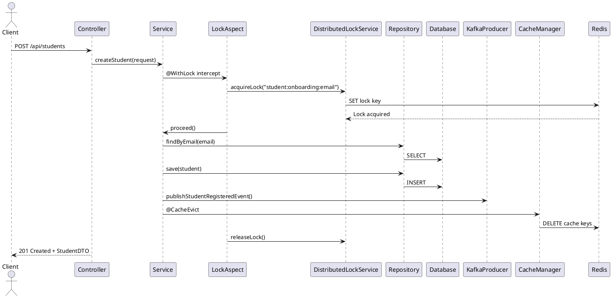
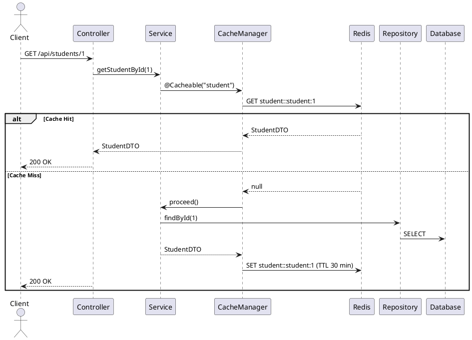
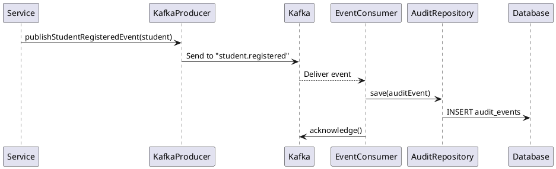

# Academy Backend — Technical Reference

## Contents

1. [System Architecture](#system-architecture)
2. [Module Design](#module-design)
3. [Data Model](#data-model)
4. [Caching Layer](#caching-layer)
5. [API Contracts](#api-contracts)
6. [Error Handling](#error-handling)
7. [Request Flow Diagrams](#request-flow-diagrams)
8. [Deployment](#deployment)
9. [Running with Docker](#running-with-docker)
10. [Integration Testing](#integration-testing)
11. [Limitations & Roadmap](#limitations--roadmap)

---

## System Architecture

### Overview

The Academy Backend is a production-ready, multi-module Spring Boot application. It implements event-driven patterns via Apache Kafka, adds Redis-based caching for read performance, and secures endpoints with JWT authentication.

### Architecture Diagram

```
┌─────────────────────────────────────────────────────────────────┐
│                        Client Tier                              │
│              (React Frontend / Mobile Applications)             │
└────────────────────────────┬────────────────────────────────────┘
                             │ HTTPS / REST
                             │
┌────────────────────────────▼────────────────────────────────────┐
│                      Application Tier                           │
│  ┌──────────────────────────────────────────────────────────┐   │
│  │         Spring Security — JWT Authentication Filter       │   │
│  └──────────────────────────────────────────────────────────┘   │
│  ┌──────────────────────────────────────────────────────────┐   │
│  │            REST Controllers (OpenAPI Interfaces)          │   │
│  │   StudentController · BatchController · ClassController   │   │
│  │   MentorController · MentorSessionController · Auth       │   │
│  │   BatchTypeController                                     │   │
│  └──────────────────────────────────────────────────────────┘   │
└────────────────────────────┬────────────────────────────────────┘
                             │
          ┌──────────────────┼──────────────────┐
          │                  │                  │
  ┌───────▼────────┐ ┌───────▼────────┐ ┌──────▼─────────┐
  │  Service Layer │ │  Cache Layer   │ │  Kafka Layer   │
  │                │ │                │ │                │
  │  Student       │ │  Redis / TTL   │ │  Producers     │
  │  Batch       ◄─┤ │  per entity    │ │  Consumers     │
  │  Class         │ │                │ │                │
  │  Mentor        │ └────────────────┘ └────────────────┘
  │  MentorSession │
  └───────┬────────┘
          │
  ┌───────▼────────┐
  │   Data Layer   │
  │                │
  │  JPA Repos     │
  │  Entities      │
  │  Flyway        │
  └───────┬────────┘
          │
  ┌───────▼────────┐
  │   MySQL 8.0    │
  └────────────────┘
```

### Technology Stack

| Category | Technology |
|----------|------------|
| Language / Runtime | Java 21 |
| Framework | Spring Boot 3.2.0 |
| Persistence | Spring Data JPA, Hibernate, Flyway |
| Database | MySQL 8.0 |
| Cache | Redis 7 (Spring Cache abstraction) |
| Messaging | Apache Kafka, Spring Kafka |
| Security | Spring Security, JWT |
| Mapping | MapStruct, Lombok |
| API Docs | Springdoc OpenAPI, Swagger UI |
| Containerization | Docker, Docker Compose |

### Module Layout

```
academy-backend/
├── modules/
│   ├── academy-api/              # Controllers, security, configuration
│   ├── academy-service/          # Business logic, mappers, AOP aspects
│   ├── academy-common/           # Entities, DTOs, repositories, exceptions
│   ├── academy-kafka-producer/   # Domain event publishers
│   └── academy-kafka-consumer/   # Audit event consumers
```

---

## Module Design

### `academy-api`

**Controllers**
- Implement OpenAPI-generated interfaces
- Receive generated request models (`*Input`); return generated response models
- Delegate all business logic to the service layer

**Security**
- JWT extraction and validation in `JwtAuthenticationFilter`
- Configurable header name and token prefix
- Public endpoints: `/api/auth/**`, `/swagger-ui/**`, `/api-docs/**`, `/actuator/**`

**Configuration**
- `RedisConfig` — serializers, TTL per cache name
- `KafkaConfig` — topic definitions (3 partitions, RF 1)
- `OpenApiConfig` — API info, JWT security scheme
- `SecurityConfig` — filter chain, CORS

### `academy-service`

**Services**
- Transaction-scoped business logic
- `@Cacheable` / `@CacheEvict` annotations on read/write operations
- `@WithLock` for distributed locking on critical writes

**MapStruct Mappers**
- Compile-time DTO ↔ Entity conversion
- Explicit `@Mapping` only where field names differ

**AOP**
- `LockAspect` — intercepts `@WithLock`; acquires Redis lock via `DistributedLockService`
- SpEL expressions resolve lock keys from method arguments

### `academy-common`

**Entities** — JPA annotations, `@Version` for optimistic locking, lazy-loaded associations

**DTOs** — Validation annotations (`@NotBlank`, `@NotNull`, `@Email`); version field for concurrency control

**Exceptions** — Domain-specific exceptions mapped to Problem Details (RFC 7807) by `GlobalExceptionHandler`

**Repositories** — Spring Data JPA; custom query methods where needed

### Kafka Modules

**Producer** — `KafkaTemplate`-based publishers; each domain event carries type, timestamp, and payload map

**Consumer** — `@KafkaListener` with manual acknowledgment; on success persists event to `audit_events`

### Design Patterns

| Pattern | Where Applied |
|---------|---------------|
| Repository | Data access via Spring Data JPA |
| Service Layer | Business logic separated from controllers |
| DTO | API contracts isolated from domain entities |
| MapStruct Factory | Type-safe, compile-time object mapping |
| AOP | Distributed locking, caching |
| Event-Driven | Kafka messaging for loose coupling |
| Strategy | Per-entity cache TTL configuration |

---

## Data Model

### Entity Relationship Diagram

```
┌─────────────────────────────────────────────────────────────────────────┐
│                         ACADEMY DATABASE SCHEMA                          │
└─────────────────────────────────────────────────────────────────────────┘

┌──────────────┐
│  BatchType   │
├──────────────┤
│ id (PK)      │
│ name (UNIQUE)│
└──────┬───────┘
       │ 1:Many
       ▼
┌──────────────┐         ┌──────────────┐
│    Batch     │◄── Many─┤   Student    │──── Self-Ref (buddyId)
├──────────────┤         ├──────────────┤
│ id (PK)      │         │ id (PK)      │
│ name         │         │ name         │
│ startMonth   │         │ email (UNIQ) │
│ instructor   │         │ gradYear     │
│ batchTypeId  │         │ university   │
│ version      │         │ phone        │
└──────┬───────┘         │ batchId (FK) │
       │                 │ buddyId (FK) │
       │ Many:Many       │ version      │
       ▼                 └──────┬───────┘
┌──────────────┐                │ 1:Many
│    Class     │                ▼
├──────────────┤         ┌──────────────────┐
│ id (PK)      │         │  MentorSession   │
│ name         │         ├──────────────────┤
│ date         │         │ id (PK)          │
│ time         │         │ time             │
│ instructor   │         │ durationMinutes  │
└──────────────┘         │ studentId (FK)   │
(via batches_classes)    │ mentorId (FK)    │
                         │ studentRating    │
                         │ mentorRating     │
                         │ version          │
                         └────────┬─────────┘
                                  │ Many:1
                                  ▼
                         ┌──────────────┐
                         │    Mentor    │
                         ├──────────────┤
                         │ id (PK)      │
                         │ name         │
                         │ company      │
                         └──────────────┘

┌──────────────────┐     ┌──────────────────────────┐
│  AuditEvent      │     │  StudentBatchHistory      │
├──────────────────┤     ├──────────────────────────┤
│ id (PK)          │     │ id (PK)                  │
│ eventType        │     │ studentId (FK)            │
│ payload (TEXT)   │     │ batchId (FK)             │
│ createdAt        │     │ shiftDate                 │
└──────────────────┘     └──────────────────────────┘
```

### Table Definitions

#### `batch_types`
| Column | Type | Constraints |
|--------|------|-------------|
| id | BIGINT | PK, AUTO_INCREMENT |
| name | VARCHAR(255) | NOT NULL |
| description | TEXT | |

#### `batches`
| Column | Type | Constraints |
|--------|------|-------------|
| id | BIGINT | PK, AUTO_INCREMENT |
| name | VARCHAR(255) | NOT NULL |
| start_month | DATE | |
| current_instructor | VARCHAR(255) | |
| batch_type_id | BIGINT | FK → batch_types.id |
| version | INT | Optimistic locking |

#### `students`
| Column | Type | Constraints |
|--------|------|-------------|
| id | BIGINT | PK, AUTO_INCREMENT |
| name | VARCHAR(255) | NOT NULL |
| email | VARCHAR(255) | UNIQUE, NOT NULL |
| graduation_year | INT | |
| university_name | VARCHAR(255) | |
| phone_number | VARCHAR(50) | |
| batch_id | BIGINT | FK → batches.id, NULLABLE |
| buddy_id | BIGINT | FK → students.id, NULLABLE |
| version | INT | Optimistic locking |

#### `classes`
| Column | Type | Constraints |
|--------|------|-------------|
| id | BIGINT | PK, AUTO_INCREMENT |
| name | VARCHAR(255) | NOT NULL |
| date | DATE | NOT NULL |
| time | TIME | NOT NULL |
| instructor | VARCHAR(255) | NOT NULL |

#### `mentors`
| Column | Type | Constraints |
|--------|------|-------------|
| id | BIGINT | PK, AUTO_INCREMENT |
| name | VARCHAR(255) | NOT NULL |
| current_company | VARCHAR(255) | |

#### `mentor_sessions`
| Column | Type | Constraints |
|--------|------|-------------|
| id | BIGINT | PK, AUTO_INCREMENT |
| time | DATETIME | NOT NULL |
| duration_minutes | INT | NOT NULL |
| student_id | BIGINT | FK → students.id, NOT NULL |
| mentor_id | BIGINT | FK → mentors.id, NOT NULL |
| student_rating | INT | 1–5, NULLABLE |
| mentor_rating | INT | 1–5, NULLABLE |
| version | INT | Optimistic locking |

#### `batch_classes` (Join Table)
| Column | Type | Constraints |
|--------|------|-------------|
| batch_id | BIGINT | FK → batches.id |
| class_id | BIGINT | FK → classes.id |

Composite primary key: `(batch_id, class_id)`

#### `audit_events`
| Column | Type | Constraints |
|--------|------|-------------|
| id | BIGINT | PK, AUTO_INCREMENT |
| event_type | VARCHAR(255) | NOT NULL |
| payload | TEXT | JSON |
| created_at | TIMESTAMP | NOT NULL |

#### `student_batch_history`
| Column | Type | Constraints |
|--------|------|-------------|
| id | BIGINT | PK, AUTO_INCREMENT |
| student_id | BIGINT | FK → students.id, NOT NULL |
| batch_id | BIGINT | FK → batches.id, NOT NULL |
| shift_date | DATE | NOT NULL |

### Indexes

**Unique:** `students.email`, `batch_types.name`

**Foreign Keys (all indexed):** `batches.batch_type_id`, `students.batch_id`, `students.buddy_id`, `mentor_sessions.student_id`, `mentor_sessions.mentor_id`, `student_batch_history.student_id`, `student_batch_history.batch_id`

**Composite:** `batch_classes(batch_id, class_id)` — composite PK

### Flyway Migrations

- `V1__init.sql` — full schema creation and seed data
- `V2__add_version_columns.sql` — adds `version` columns for optimistic locking

---

## Caching Layer

### Implementation

Spring Cache abstraction with Redis as the backend. Configured in `RedisConfig` with:
- JSON serialization via Jackson
- String key serialization
- Null value prevention (`disableCachingNullValues()`)
- Per-cache TTL through `RedisCacheConfiguration`

### TTL Strategy

| Cache Name | TTL | Reason |
|------------|-----|--------|
| `mentorSession`, `mentorSessions` | 10 minutes | High-frequency changes |
| `mentor`, `mentors`, `batchType`, `batchTypes` | 1 hour | Stable reference data |
| `student`, `students`, `batch`, `batches`, `class`, `classes` | 30 minutes | Standard transactional data |

### Key Naming

Spring Cache default pattern:
```
{cacheName}::{keyExpression}
```

Examples:
```
student::student:1          → individual student
students::all               → full student list
students::batch:1           → students in batch #1
batch::batch:1              → individual batch
mentorSession::mentorSession:1
```

### Cache Operations

**Read operations (`@Cacheable`):**
- Cached: non-null, non-empty GET responses
- Not cached: null values, empty collections

**Write operations (`@CacheEvict`):**
```java
// On create — evict all entries in related caches
@CacheEvict(value = {"student", "students"}, allEntries = true)

// On update / delete — evict specific entry and all list caches
@CacheEvict(value = {"student", "students"}, key = "'student:' + #id", allEntries = true)
```

### Monitoring

```bash
docker exec -it academy-redis redis-cli KEYS "*student*"
docker exec -it academy-redis redis-cli TTL "student::student:1"
docker exec -it academy-redis redis-cli MONITOR
```

Spring Actuator endpoints:
- `/actuator/health` — Redis connectivity status
- `/actuator/metrics` — cache statistics

---

## API Contracts

### Base URL

`http://localhost:8080` (local and Docker)

### Authentication

Header: `Authorization: Bearer <jwt-token>`

**Login:**
```
POST /api/auth/login
{"username": "admin@academy.com", "password": "password123"}

→ {"token": "eyJ...", "type": "Bearer"}
```

**Validate:**
```
POST /api/auth/validate
{"token": "eyJ..."}

→ {"valid": true, "username": "admin@academy.com"}
```

### Students

| Method | Path | Description | Cache |
|--------|------|-------------|-------|
| GET | `/api/students` | List (optional `?batchId=`) | students::all / students::batch:{id} |
| GET | `/api/students/paged` | Paginated list | — |
| GET | `/api/students/{id}` | By ID | student::student:{id} |
| POST | `/api/students` | Create | evicts student+students |
| PUT | `/api/students/{id}` | Update | evicts student+students |
| DELETE | `/api/students/{id}` | Delete | evicts student+students |

Kafka: `student.registered` on POST

### Batches

| Method | Path | Description |
|--------|------|-------------|
| GET | `/api/batches` | Paginated list |
| GET | `/api/batches/{id}` | By ID |
| POST | `/api/batches` | Create (Kafka: `batch.created`) |
| PUT | `/api/batches/{id}` | Update |
| DELETE | `/api/batches/{id}` | Delete |
| POST | `/api/batches/{id}/classes/{classId}` | Assign class |

### Classes

`GET /api/classes` · `GET /api/classes/{id}` · `POST /api/classes` · `PUT /api/classes/{id}` · `DELETE /api/classes/{id}`

### Batch Types

| Method | Path | Description | Cache |
|--------|------|-------------|-------|
| GET | `/api/batch-types` | List all batch types | batchTypes::all (1 hour) |
| GET | `/api/batch-types/{id}` | By ID | batchType::batchType:{id} (1 hour) |
| POST | `/api/batch-types` | Create | evicts batchType+batchTypes |
| PUT | `/api/batch-types/{id}` | Update | evicts batchType+batchTypes |
| DELETE | `/api/batch-types/{id}` | Delete | evicts batchType+batchTypes |

### Mentors

`GET /api/mentors` · `GET /api/mentors/{id}` · `POST /api/mentors` · `PUT /api/mentors/{id}` · `DELETE /api/mentors/{id}`

Cache TTL: 1 hour

### Mentor Sessions

`GET /api/mentor-sessions` · `GET /api/mentor-sessions/{id}` · `POST /api/mentor-sessions` · `PUT /api/mentor-sessions/{id}` · `DELETE /api/mentor-sessions/{id}`

Kafka: `mentor.session.created` on POST · Cache TTL: 10 minutes

### Error Response Format (RFC 7807)

```json
{
  "type": "uri://academy-backend/errors/student-not-found",
  "title": "Student Not Found",
  "status": 404,
  "detail": "Student with id 999 not found",
  "instance": "/api/students/999"
}
```

---

## Error Handling

### Exception Hierarchy

```
RuntimeException
├── StudentNotFoundException
├── BatchNotFoundException
├── ClassNotFoundException
├── MentorNotFoundException
├── MentorSessionNotFoundException
├── BatchTypeNotFoundException
├── LockAcquisitionException
└── OptimisticLockException
```

### GlobalExceptionHandler

Converts all domain exceptions and validation errors into consistent RFC 7807 Problem Details responses. Validation failures return field-level error messages.

---

## Request Flow Diagrams

### Student Creation



### Student Read with Cache



### Kafka Event Processing



---

## Deployment

### Prerequisites

- Docker & Docker Compose
- Java 21+ (for local dev)
- MySQL 8.0+ (if not Docker)
- Redis 7+ (if not Docker)

### Environment Variables

```bash
SPRING_PROFILES_ACTIVE=docker
SPRING_DATASOURCE_URL=jdbc:mysql://mysql:3306/academy_db
SPRING_DATASOURCE_USERNAME=root
SPRING_DATASOURCE_PASSWORD=rootpassword
SPRING_KAFKA_BOOTSTRAP_SERVERS=kafka:9092
SPRING_REDIS_HOST=redis
SPRING_REDIS_PORT=6379
JWT_SECRET=your-secret-key-here
JWT_EXPIRATION=86400000
```

### Build and Deploy

```bash
# Build
./gradlew clean build -x test

# Docker image
docker build -t academy-backend:latest .

# Start full stack
docker-compose -f docker-compose.infrastructure.yml up -d

# Verify
curl http://localhost:8080/actuator/health
```

### Kubernetes (Future)

Deploy MySQL and Kafka as StatefulSets, use ConfigMaps/Secrets for configuration, and expose via Ingress.

---

## Running with Docker

```bash
# Start everything
docker-compose up --build

# Background mode
docker-compose up -d

# Tail logs
docker-compose logs -f academy-backend

# Stop
docker-compose down

# Wipe volumes
docker-compose down -v
```

### Running Services

| Container | Purpose | Port |
|-----------|---------|------|
| academy-backend | Main API | 8080 |
| academy-mysql | Database | 3306 |
| academy-redis | Cache | 6379 |
| academy-kafka | Event broker | 9092 |
| academy-zookeeper | Kafka coordination | 2181 |
| academy-kafka-consumer | Audit consumer | — |

---

## Integration Testing

Tests use Testcontainers to spin up real MySQL, Redis, and Kafka instances — no mocks for infrastructure.

```bash
./gradlew test                                        # all tests
./gradlew test --tests "*Integration*"                # integration only
./gradlew test --tests "*Test" --exclude-tests "*Integration*"  # unit only
```

Coverage targets: service layer > 80%; all API endpoints; Kafka produce/consume round-trip.

---

## Limitations & Roadmap

### Current Limitations

| Area | Limitation |
|------|-----------|
| Authentication | No OAuth2 / RBAC / refresh tokens |
| Caching | Single Redis node; no cluster |
| Search | No full-text search |
| Monitoring | No distributed tracing |
| Security | JWT secret in config; no rate limiting |

### Roadmap

**Near-term**
- Database-backed user store with RBAC
- Prometheus + Grafana dashboards
- Distributed tracing (Jaeger/Zipkin)
- Test coverage to 80%+

**Medium-term**
- Redis cluster for high availability
- Kafka multi-broker setup
- Rate limiting and API key management
- Secrets management (Vault)

**Long-term**
- Kubernetes deployment with service mesh
- GraphQL API layer
- Elasticsearch for full-text search
- CI/CD pipeline with blue-green deployments

---

**Document Version:** 1.0 · **Last Updated:** 2025-11-29 · **Team:** Academy Development
